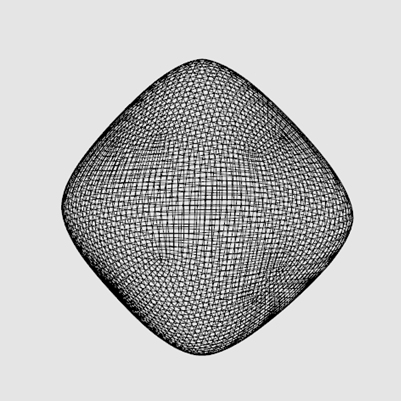
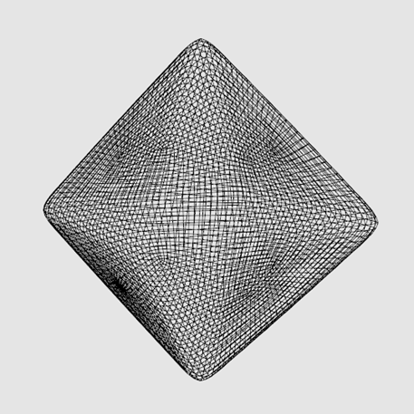

# MeshViewer

* Implement Catmull-Clark Subdivision from scratch. demo: https://youtu.be/M3ZXa4viUOU

    

* Implement laplacian explicit & implicit smoothing algorithm with uniform & cotangent weighting scheme

HKUST COMP5411 course works
